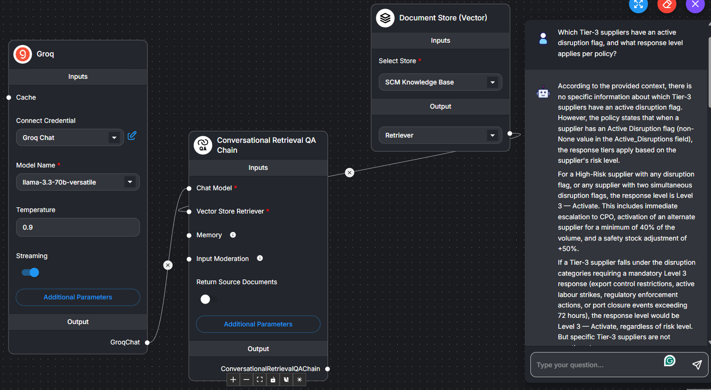
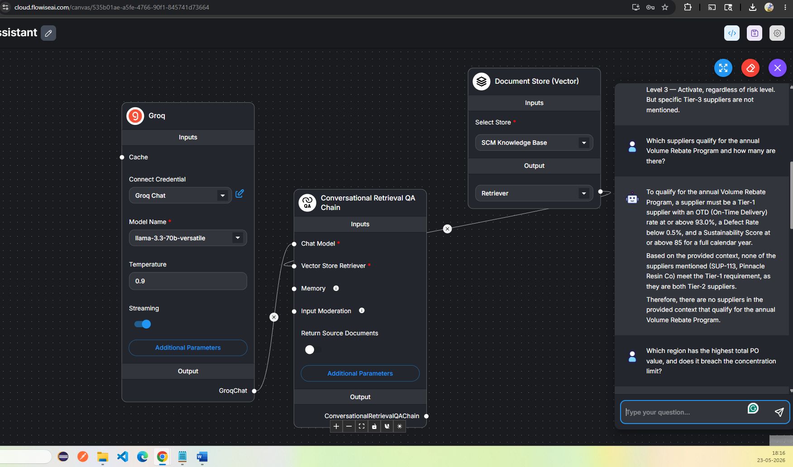
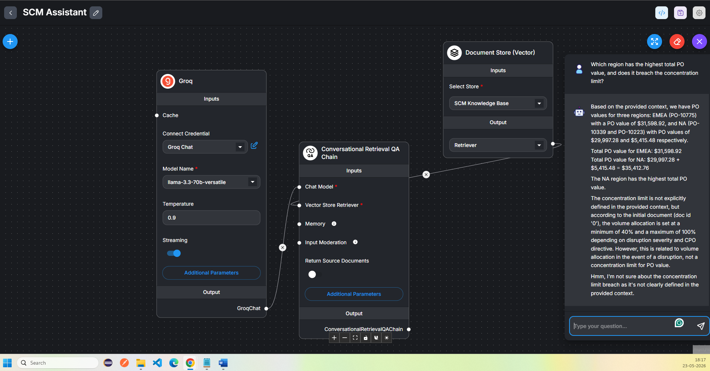
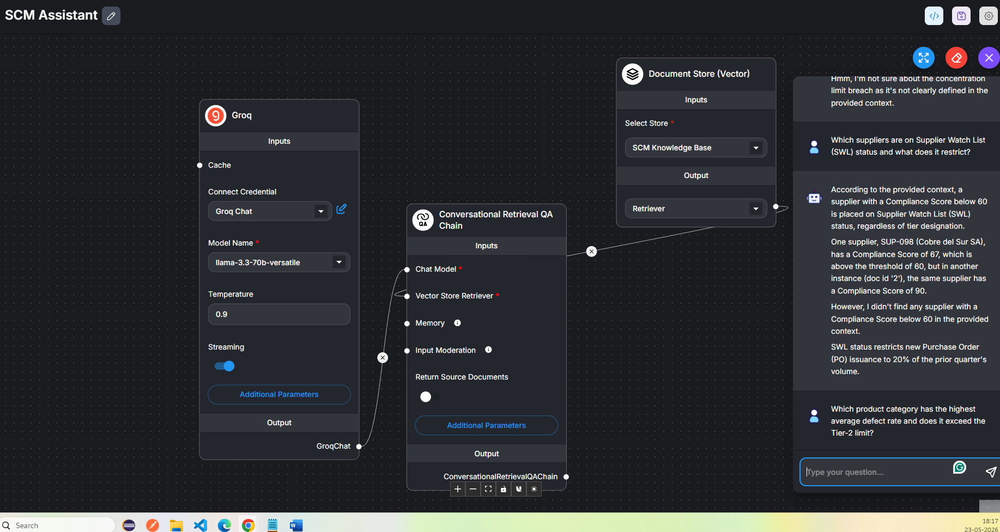
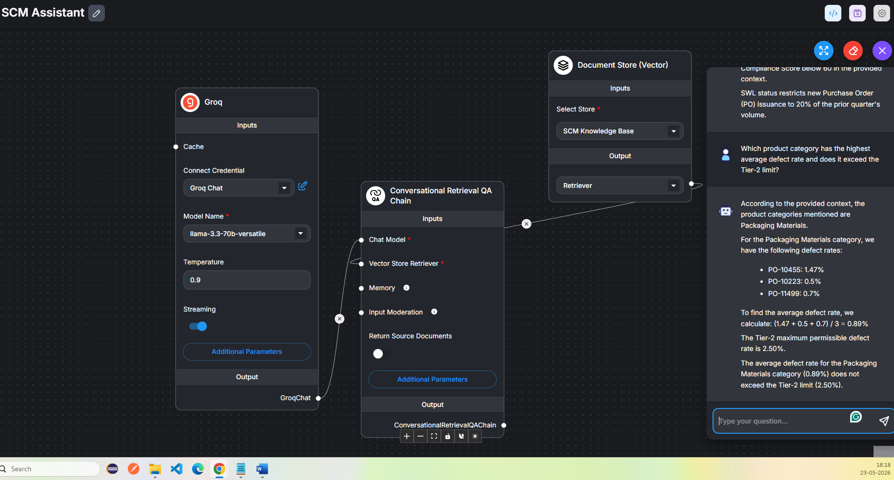

# 🚚 SCM Assistant - Supply Chain RAG Chatbot

An AI-powered Supply Chain Management Assistant built using **Flowise AI**, **Groq**, **Pinecone**, and **HuggingFace Embeddings**.

The chatbot uses Retrieval-Augmented Generation (RAG) to answer supplier governance, disruption risk, compliance, and procurement policy related questions from uploaded enterprise documents.

---

# 🔗 Public Chatbot URL

👉 https://cloud.flowiseai.com/chatbot/535b01ae-a5fe-4766-90f1-845741d73664

---

# 🛠️ Tech Stack

| Component | Technology |
|---|---|
| Framework | Flowise AI |
| LLM | Groq (`llama-3.3-70b-versatile`) |
| Embeddings | `sentence-transformers/all-MiniLM-L6-v2` |
| Vector Database | Pinecone |
| Similarity Search | Cosine Similarity |

---

# ⚙️ Model Configuration

## 🤖 LLM Configuration
- Model: `llama-3.3-70b-versatile`
- Temperature: `0.9`

## 🧠 Embedding Configuration
- Model: `sentence-transformers/all-MiniLM-L6-v2`

## 🗂️ Pinecone Configuration
- Vector Type: `Dense`
- Dimension: `384`
- Metric: `Cosine`

---

# ✂️ Chunking Experiments

## 📄 CSV Configuration
- Chunking Strategy: Default Row-wise Chunking
- Total Chunks Generated: `2000`

## 📘 PDF Configuration
- Splitter: `Token Text Splitter`
- Chunk Size: `500`
- Chunk Overlap: `80`
- Total Chunks Generated: `13`

---

# 🧩 Chatflow Architecture

```text
Groq Chat Model
        ↓
Conversational Retrieval QA Chain
        ↑
Pinecone Vector Store Retriever
```


# ✅ Validation Questions & Answers

## ❓ Q1. Which Tier-3 suppliers have an active disruption flag, and what response level applies per policy?

**Answer:**  


```
According to the provided context, there is no specific information about which Tier-3 suppliers have an active disruption flag. However, the policy states that when a supplier has an Active Disruption flag (non-None value in the Active_Disruptions field), the response tiers apply based on the supplier's risk level.

For a High-Risk supplier with any disruption flag, or any supplier with two simultaneous disruption flags, the response level is Level 3 — Activate. This includes immediate escalation to CPO, activation of an alternate supplier for a minimum of 40% of the volume, and a safety stock adjustment of +50%.

If a Tier-3 supplier falls under the disruption categories requiring a mandatory Level 3 response (export control restrictions, active labour strikes, regulatory enforcement actions, or port closure events exceeding 72 hours), the response level would be Level 3 — Activate, regardless of risk level. But specific Tier-3 suppliers are not mentioned.
```

---

## ❓ Q2. Which suppliers qualify for the annual Volume Rebate Program and how many are there?

**Answer:**  


```
To qualify for the annual Volume Rebate Program, a supplier must be a Tier-1 supplier with an OTD (On-Time Delivery) rate at or above 93.0%, a Defect Rate below 0.5%, and a Sustainability Score at or above 85 for a full calendar year.

Based on the provided context, none of the suppliers mentioned (SUP-113, Pinnacle Resin Co) meet the Tier-1 requirement, as they are both Tier-2 suppliers.

Therefore, there are no suppliers in the provided context that qualify for the annual Volume Rebate Program.
```

---


## ❓ Q3. Which region has the highest total PO value, and does it breach the concentration limit?

**Answer:**  


```
Based on the provided context, we have PO values for three regions: EMEA (PO-10775) with a PO value of $31,598.92, and NA (PO-10339 and PO-10223) with PO values of $29,997.28 and $5,415.48 respectively.

Total PO value for EMEA: $31,598.92
Total PO value for NA: $29,997.28 + $5,415.48 = $35,412.76

The NA region has the highest total PO value.

The concentration limit is not explicitly defined in the provided context, but according to the initial document (doc id '0'), the volume allocation is set at a minimum of 40% and a maximum of 100% depending on disruption severity and CPO directive. However, this is related to volume allocation in the event of a disruption, not a concentration limit for PO value.

Hmm, I'm not sure about the concentration limit breach as it's not clearly defined in the provided context.
```

---

## ❓ Q4. Which suppliers are on Supplier Watch List (SWL) status and what does it restrict?

**Answer:**  


```
According to the provided context, a supplier with a Compliance Score below 60 is placed on Supplier Watch List (SWL) status, regardless of tier designation.

One supplier, SUP-098 (Cobre del Sur SA), has a Compliance Score of 67, which is above the threshold of 60, but in another instance (doc id '2'), the same supplier has a Compliance Score of 90.

However, I didn't find any supplier with a Compliance Score below 60 in the provided context.

SWL status restricts new Purchase Order (PO) issuance to 20% of the prior quarter's volume.

```

---
## ❓ Q5. Which product category has the highest average defect rate and does it exceed the Tier-2 limit?


**Answer:**  


```
According to the provided context, the product categories mentioned are Packaging Materials.

For the Packaging Materials category, we have the following defect rates:

PO-10455: 1.47%
PO-10223: 0.5%
PO-11499: 0.7%
To find the average defect rate, we calculate: (1.47 + 0.5 + 0.7) / 3 = 0.89%

The Tier-2 maximum permissible defect rate is 2.50%.

The average defect rate for the Packaging Materials category (0.89%) does not exceed the Tier-2 limit (2.50%).
```

---

# 🚀 Future Improvements

## ✨ Better Prompt Engineering

The chatbot currently provides relevant answers from the uploaded documents, but the response formatting can be improved further to make answers more structured and closer to expected policy-based outputs.

A better prompt can help:
- improve answer consistency
- reduce unnecessary text
- provide cleaner supplier and policy references
- generate more structured outputs

### 📌 Example Prompt Improvement

```text
You are a Supply Chain Governance Assistant.

Instructions:
- Answer only from the uploaded documents.
- Keep responses short and structured.
- Mention supplier names clearly.
- Include policy references when available.
- Avoid assumptions or unrelated information.
```

This would help generate more accurate and better formatted responses.

---

## 📊 Pinecone Index & Report Management

Another improvement would be maintaining better Pinecone index monitoring and reporting.

Possible enhancements:
- tracking uploaded document chunks
- monitoring vector indexing status
- improving chunk configurations
- reducing duplicate or irrelevant chunks
- improving retrieval accuracy

This can help improve chatbot performance and maintain better search quality over time.

---

## ⚡ Additional Improvements

- Better chunking strategy for structured retrieval
- Metadata filtering support
- Improved response formatting
- Source references in chatbot responses
- Better retrieval ranking
- Basic analytics dashboard for supplier insights


